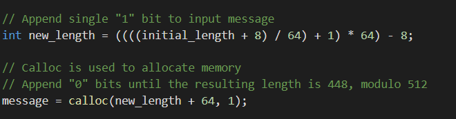

# Introduction

This project was created as part of the Theory of Algorithms module in the 4th year of the Computing in Software Development taught at GMIT. The project statement was the we, the students, develop a program, written in the C programming language, that calculates the MD5 hash digest of a given input. The construction of the MD5 algorithm is outlined in the RFC 1321 document created by the Internet Engineering Task Force[1]. This request for this report was created as a late addition due the Covid_19 outbreak and aims to provide an overview of the project and to include instructions on how the program should be compiled and run, instructions on how to run the test suite included in the program, an overview of the algorithm used in the program code and a section on the complexity of the MD5 algorithm itself.

## The repository contains:   

* Overview.md, which is this file.
* README.md, which is a file written in the markdown language which contains comprehensive information on how to install and run the code. It also contains a breakdown of the research involved in the original projects development.
* Video Tutorials(folder) which contains snippets of code provided via online lecture videos provided by the lecturer.
* Test(folder), this folder contains .txt files which are used as part of the testing of file input to the MD5 algorithm.
* Images(folder), contains images used in overview.md
* md5.c, which is a c file used locally, exclusively for testing purposes.
* main.c, which is the file that contains the MD5 algorithm and a main method, both written in the C language, this is the file which must be compiled to run the MD5 algorithm


# Run

This section is in place to provide instructions on how to clone, compile and run the project code. It will also will also detail how to create a linux subsystem on a windows operating system, as was performed for the development of this project and also how to install a C compiler on said system.

## Setting up environment  
* Open Powershell and select the "Run as an Administrator" option.
* From here enter the following command into the Powershell terminal  
```Enable-WindowsOptionalFeature -Online -FeatureName Microsoft-Windows-Subsystem-Linux```
* After this command has finished running you will be forced to reboot your device.
* Follow this link, to get the free Ubuntu subsystem installed on you Windows OS, [here](https://www.microsoft.com/en-ie/p/ubuntu-2004-lts/9n6svws3rx71?activetab=pivot:overviewtab)
* From here select the "Get" option to be taken to the Microsoft store and from the Microsoft store select the "Install" option.
* After the installation a linux terminal window will open, from here follow the commands presented in the terminal to set up your linux environment.
* After the environment has been set up, enter the following command to install a C compiler  
``` sudo apt install gcc ```  
* To confirm that the C compiler has been installed, enter the following command  
``` gcc --version ```

## Clone, Compile, Run
* From the Ubuntu subsystem, enter the following line to clone the repository  
``` Git Clone https://github.com/CookeRichard94/MD5-message-digest-algorithm ```
* From here, change directory to the project by entering the following command  
``` cd MD5-message-digest-algorithm/ ```
* To compile the project code  
``` gcc -lm -Wall -o md5 main.c ```
* To run the code and to hash an input string, enter the following command:   
``` ./md5 -s "Your string here" ```   
* To run the code and see a set of test cases being run, enter the following command:   
``` ./md5 -t anyArgument ```   
* To list options to be entered, enter the following command:   
``` ./md5 -h anyArgument ```

# Test 
The test cases used in this project are the same test cases used in the Official RFC document[1].
The test cases test 7 different inputs "", "a", "abc", "message digest", "abcdefghijklmnopqrstuvwxyz", "ABCDEFGHIJKLMNOPQRSTUVWXYZabcdefghijklmnopqrstuvwxyz0123456789" and "12345678901234567890123456789012345678901234567890123456789012345678901234567890".  
  
To run the tests to ascertain whether the hash algorithm is working correctly, enter -t followed by any argument.   
**For example**   
``` ./md5 -t xxx```  
The Output from running these commands should look as follows:  
```
Input: 'a'  Should produce output: 0cc175b9c0f1b6a831c399e269772661   
   
The Hash Output of this Input is: 0cc175b9c0f1b6a831c399e269772661
```

# Algorithm
The MD5 message-digest algorithm is a hashing algorithm, released in 1992, that takes in a an input message of arbitrary length and outputs a 128-bit message-digest of the input[1]. It has been designed such that it is infeasible that any two different inputs will produce the same message-digest. 
### Example
 Input ``` Hello world ``` produces output ``` 3e25960a79dbc69b674cd4ec67a72c62 ```  
 Input ``` hello world ``` produces output ``` 5eb63bbbe01eeed093cb22bb8f5acdc3 ```

The core purpose of the MD5 algorithm is that it is used to ensure data integrity. This means that data remains consistent and can be proven to be non-altered. I found [this video](https://www.youtube.com/watch?v=33QT7xohUvI&t=)[2] to have been helpful in accurately displaying how even the most minute change will have a profound effect on the hash digest produced by the algorithm and how obvious the algorithm allows data tampering to be exposed. In cases such as when a file is compressed and sent to another machine this "fingerprint" security is important in ensuring data integrity.

<a href="http://www.youtube.com/watch?feature=player_embedded&v=33QT7xohUvI&t=" target="_blank"></a>
   
**The MD5 Algorithm is performed in 5 steps**[1]  
    

## Step 1. Append Padding Bits
The padding of the input message is extending it so that when it's length(in bits) when divided by 512, leaves a remainder of 448. This padding operation is always performed even if the initial length of the input message is 448 bits. The padding will be at least 1 bit and at most 512. This padding is performed by appending a single "1" bit to the input message and then adding additional "0" bits until the new length of the message is 448, modulo 512.  



## Step 2. Append Length  
A 64 bit representation of the initial length of the input message is appended to the result of the previous steps padding process. After this has occurred the length of the message is now exactly 512 bits, this now allows the message to be structured into 16, 32-bit words.  


## Step 3. Initialize MD Buffer  
A four word buffer of A,B,C,D(each 32-bits) is initialized with the following hexadecimal values  
```
A: 01 23 45 67 
  
B: 89 ab cd ef
  
C: fe dc ba 98
  
D: 76 54 32 10
```


## Step 4. Process Message in 16-Word Blocks  
For this step 4 functions are created that take in 3, 32-bit "words" as their parameters and return a single 32-bit "word" as output. This is done using bit wise operators.
```
&	bitwise AND
|	bitwise inclusive OR
^	bitwise XOR (exclusive OR)
<<	left shift
>>	right shift
~	bitwise NOT
```
The four auxiliary functions are described in the RFC document[1] as follows:   
```
F(X,Y,Z) = XY v not(X) Z  
X AND Y OR NOT X, AND Z  
  
G(X,Y,Z) = XZ v Y not(Z)  
X AND Z OR Y AND NOT Z  
  
H(X,Y,Z) = X xor Y xor Z  
X XOR Y XOR Z  
  
I(X,Y,Z) = Y xor (X v not(Z))
Y XOR X OR NOT Z
```
  

## Step 5. Output  
The message digest produced is output as A, B, C, D. We begin with the low-order byte of A, and end with the high-order byte of D.


# Complexity

The MD5 algorithm is an extension of the MD4 algorithm, it was conceived because it was felt that MD4 was being adapted quicker than what critical review of it could be made. While the MD4 was designed to be exceptionally fast in nature, the MD5 was conceived to be slower but to provide more likelihood of increased security[1].  
Although the time complexity of MD5 is a drop-off from that of the MD4 algorithm, it runs at a big O notation of O(n)[3], which is considered a favourable time complexity as this means that the time complexity of the algorithm grows in proportion to the length of the message it has been passed to hash. Although security-wise, both algorithms are now considered to be unsafe, the focus on security over speed by the MD5 algorithm allowed it's security to stay in tact some 10 years longer than that of the MD4 algorithm.[4] 

## Collision Attacks
In cryptography, a collision attack on a cryptographic hash tries to find two inputs producing the same hash value. While it was originally considered infeasible, hashing collision was achieved in 2005. To do this two non-identical files were structured a specific way by the researchers that the mathematical process used in the hashing process was higher than the probability to generate these hash values at random[5].
The complexity for collision attacks on MD4, MD5 and SHA-1 are as follows, MD4 (the best attack has complexity 2<sup>1</sup>), MD5 (best attack: 2<sup>23</sup>), and SHA-1 (best attack: 2<sup>60</sup>)[6].

## Countermeasures
In cryptography and encryption, a common way to fight against collision attacks is the use of salt. Salt is a random string that is attached to an input word to create a different and unique hash than what would originally have been output[7]. Adding salt is most commonly used when hashing a password. The addition of salt to a password helps to protect against Brute force, like collision attacks, and Database based attacks, such as a rainbow bridge.

# References
[1] [Rivest, R., 1992. RFC1321: The MD5 message-digest algorithm.](https://www.ietf.org/rfc/rfc1321.txt)  
This was the most used source, I found it provided a comprehensive explanation on what the MD5 algorithm was and how it would be developed. The source was primarily cited in the algorithm section of the report.   
[2] [MD5 Hash Tutorial - What the MD5 hash means and how to use it to verify file integrity](https://www.youtube.com/watch?v=33QT7xohUvI&t=)    
This video allowed me to gain an understanding of just how minute a change triggers a complete overhaul by the md5 algorithm.   
[3] [Time Complexity of MD5](https://stackoverflow.com/questions/43625569/time-complexity-of-md5)   
This source outlined what the time complexity of the MD5 algorithm was, previous knowledge of big O notation was gathered in seperate modules.   
[4] [Difference between MD4 and MD5](https://security.stackexchange.com/questions/71709/difference-between-md4-and-md5-encryption)  
This source provided background information that provided confirmation of the MD5 being a better hashing approach then the MD4 algorithm.   
[5] [How to break MD5 and other hash functions](https://link.springer.com/chapter/10.1007/11426639_2)  
This source outlined how the MD5, along with other hash functions where broken using collision attacks.  
[6] [MD4 is not One Way](https://who.rocq.inria.fr/Gaetan.Leurent/files/MD4_FSE08.pdf)   
This source was used for citing what the complexity for attack algorithms on the MD5 and other hash functions was.   
[7] [What is MD5 salt?](https://www.md5online.org/blog/md5-salt-hash/)    
This source was used as a reference for what salt is in relation to cryptography.   

